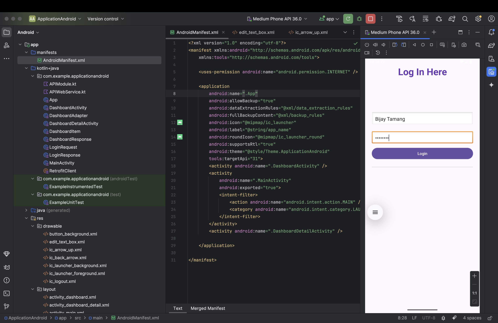
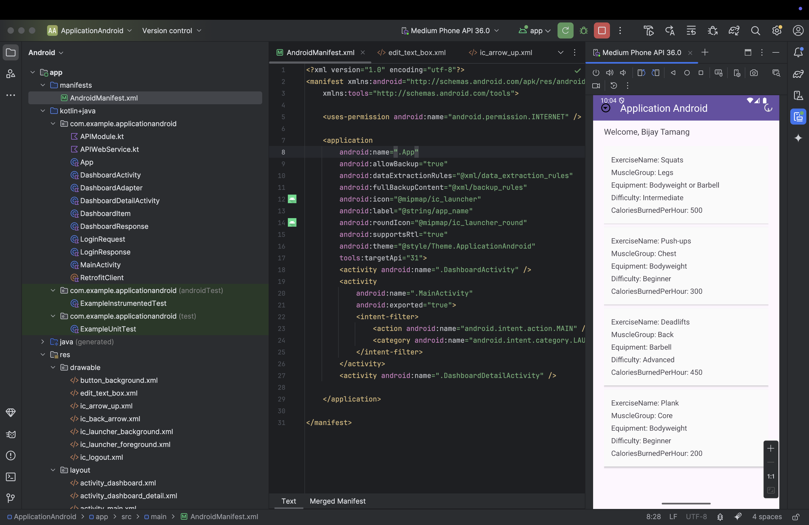
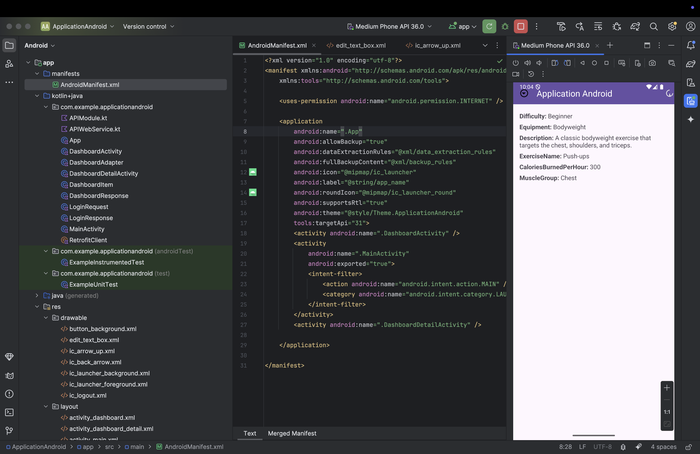

# 📚 VU Students Android Application

An Android application designed for students to log in using their Student ID and KeyPass, and access a personalized dashboard that displays their unique data ("entities"). This data can include exercises, assignments, animals types, events, grades, or any other student-specific records provided by the backend API.

## 🚀 Overview

This application is tailored to support **multiple students** with secure logins and real-time dashboard data based on who logs in. It fetches and displays a customized list of **entities** for each user, with a detail view for every item.

## 🧩 Key Features

- 🔐 **Student Login** using Student ID & KeyPass
- 📊 **Dynamic Dashboard** displaying personalized data
- 📄 **Details Screen** to explore full information about each entity
- 🌐 **Live Data Fetching** from a backend API using Retrofit
- 📱 **Modern UI** with RecyclerView, CardViews, and Navigation

## Technology Stack

- Kotlin
- HiltAndroid
- Android SDK (min SDK 28, target SDK 34)
- Retrofit for API communication
- RecyclerView for displaying lists
- AndroidX libraries and Material Design components

## Installation and Setup

1. Clone this repository:

   ```bash
   git clone https://github.com/bijaylopchan/ApplicationAndroid.git
2. Open the project in Android Studio.
3. Ensure you have an Android device or emulator running API level 28 or higher.
4. Build and run the app.
5. The app requires connection to a backend API for login and exercise data. Update the API endpoint in RetrofitClient if necessary.

## Usage

1. Launch the app.
2. Enter your username and password on the login screen.
3. Upon successful login, you will be taken to the dashboard displaying exercises.
4. Tap an exercise to view detailed information.

## Screenshots

### Login Screen


### Dashboard


### Exercise Details



